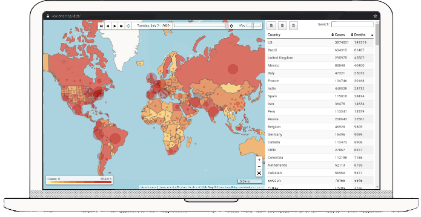
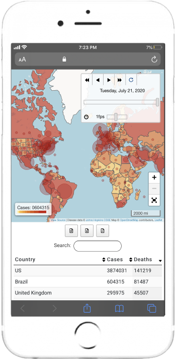
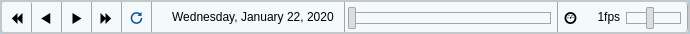
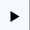
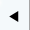
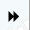
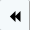
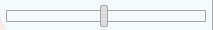
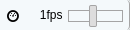
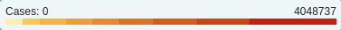

# Coronamap

Coronamap is an interactive thematic map that animates the spread of the coronavirus.

Check out the [deployment](../../deployments "Deployment").

<p align="center">
  
  
</p>

## Preview

<p align="center">
  
</p>
Disease data: <a href="https://github.com/CSSEGISandData/COVID-19">Johns Hopkins CSSE</a> (https://github.com/CSSEGISandData/COVID-19)

### Date Slider



- : Play
- : Reverse
- : Move to the next day
- : Move to the previous day
- : Loop
- : Date progress bar
- : Playback speed

### Colored Geographical Areas



The yellow-orange-red sequential color scheme shows the *number of infected cases*.

### Circle Markers

    

The size of a circle marker scales to the *number of deaths*.

## Getting Started

### Prerequisites

* Node.js
```bash
$ yum install nodejs
$ yum install npm
```

* Install npm packages
```bash
$ npm install
```

### Development
* Watch for updates to code and compile automatically: `npm run develop`
* Build the optimized production: `npm run build`
* Run all unit tests: `npm run test`
